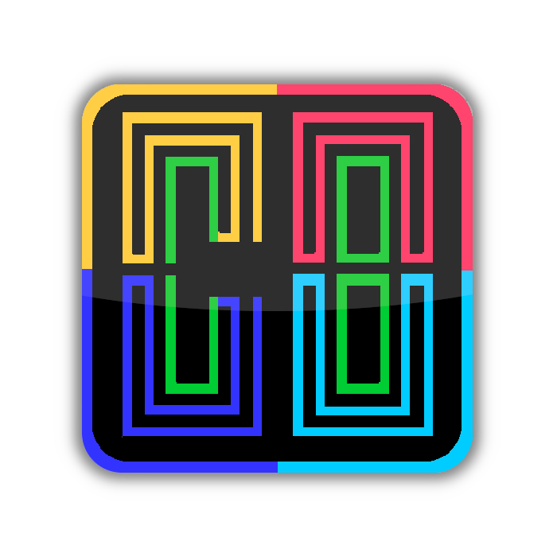
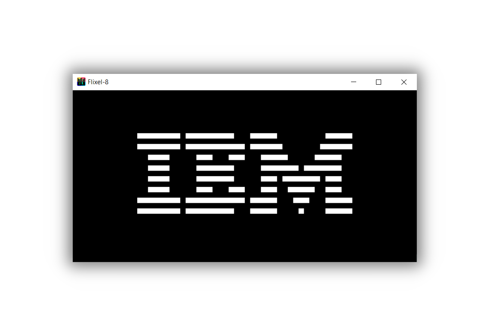
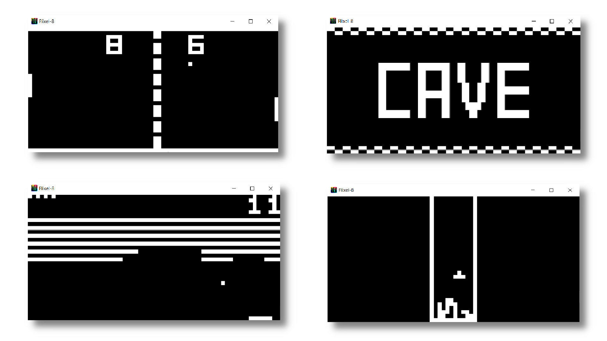
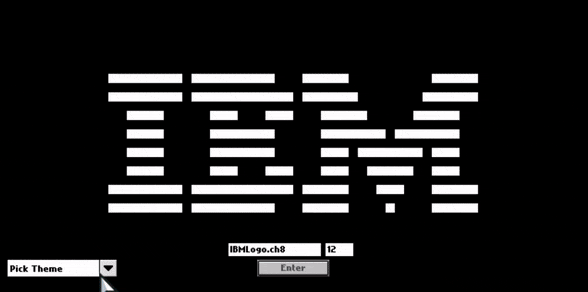
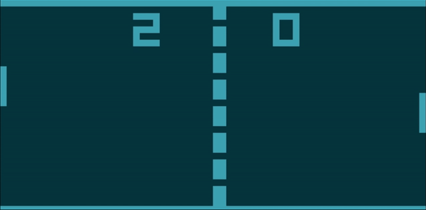
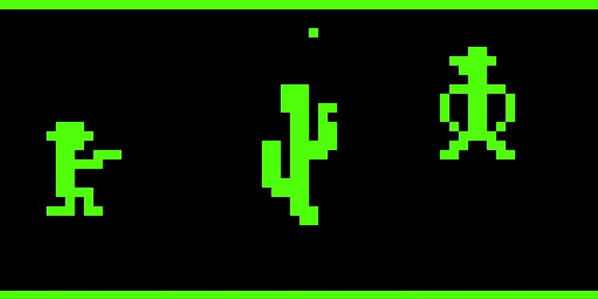
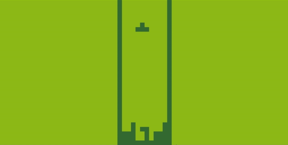
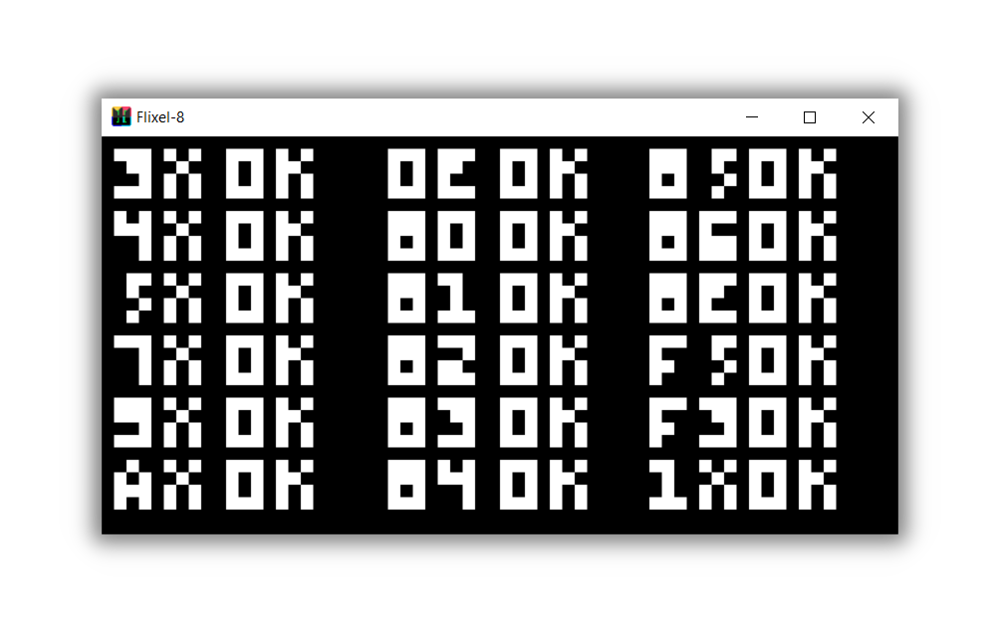

<!-- PROJECT LOGO -->
<h1 align="center">
  <br>
  <a href="https://github.com/BotRandomness/Flixel-8"></a>
  <br>
  <b>Flixel-8</b>
  <br>
  <sub><sup><b>Flixel-8, a Chip-8 emulator, written in Haxe, powered by HaxeFlixel.</b></sup></sub>
  <br>

</h1>

<a href="https://github.com/BotRandomness/Flixel-8">
    
</a>

<p align="center">
<strong>Flixel-8</strong> is a <strong>Chip-8 emulator</strong>. You may be wondering, what is a Chip-8? Well Chip-8 is actually not technically a computer, but a <em>virtual machine</em>, made initally for <strong>RCA's COSMAC VIP microprocessor in 1977</strong>. The purpose of Chip-8 was to make it easier to make games for the COSMAC VIP. Over the years, it has become very popular for developers to start making Chip-8 emulators to run Chip-8 games on all sorts of hardware. Now, why did I make a Chip-8 emulator? Well, for a few reasons. <strong>Emulation always fascinated me</strong>, and I wanted to learn a bit more on how it can be done. It just seemed so magical. I knew that best way to learn is just to get started! Ok then, why use <strong>Haxe and Haxeflixel</strong> and not like C/C++ and SDL? I have dabbled in Haxe before using HaxeFlixel, but I am no expert in either. There's already quite a few Chip-8 emulators using C/C++ and SDL, but not much with Haxe, and none really using HaxeFlixel. So wouldn't it be <strong>fun to learn Haxe and HaxeFlixel from scratch while learning to make my first emulator!</strong> <strong>Of course! :)</strong>       

</p>

</div>

<!-- ABOUT THE PROJECT -->

## Getting Started
Want to use it, and mess around? Here's how you can get started!
### Download
Currently, there is no <em>native</em> builds of Windows, MacOS, and Linux versions yet, however you can freely do it yourself!
But there is a Windows Hashlink build, which is a Windows build, with Haxe's Hashlink VM built in. <em>(Can we say VM-ception is going on)</em>
#### Hashlink (Windows)
1. Download it from [here](https://github.com/BotRandomness/Flixel-8/releases), or on the releases page.
2. Unzip the folder
3. Open the `Flixel-8.exe`
4. You are ready to go!

### Controls
The Chip-8 used the COSMAC VIP keypad, which in the emulator is mapped to a keyboard as so:
```
 COSMAC VIP          Flixel-8
------------       ------------
|1||2||3||C|       |1||2||3||4|
|4||5||6||D|  -->  |Q||W||E||R|
|7||8||9||E|       |A||S||D||F|
|A||0||B||F|       |Z||X||C||V|
------------       ------------
```
Pressing [SPACE] anytime brings up the menu where you could load/reload roms, change the number of instructions per cycle, and themes.

### Usage
- Popular Chip-8 roms are already included in the `assets/data` directory, however you add your own roms here
- Note that when inputting the rom name, it's already pointed to the `assets/data` directory
- Also note when inputting the rom name, for capital letters, use the [SHIFT] key
- Debug console will open up, showing all instructions being excuted, along with opcode, and values being used

## Screenshots
<a href="https://github.com/BotRandomness/Flixel-8">
    
</a>
<p align="center"> Pong 2, Cave, Breakout, and Tetris being showcased. (From left to right, starting top row to bottom row) </p>

### Demo Gameplay (With Themes Showcase)
<a href="https://github.com/BotRandomness/Flixel-8"></a>
<a href="https://github.com/BotRandomness/Flixel-8"></a>
<a href="https://github.com/BotRandomness/Flixel-8"></a>
<a href="https://github.com/BotRandomness/Flixel-8"></a>
<a href="https://github.com/BotRandomness/Flixel-8"></a>

## Compatibility
<a href="https://github.com/BotRandomness/Flixel-8"></a>
<p align="center"> Passes Conrax89's Test Rom and Timendus's Conrax+ Opcode Test </p>
Even though it passes the opcode test, it's not perfect. For example, the flags test does not work fully. </br>
When is comes to ROMS, here's the general so far...</br></br>

- <em>Most</em> games from the 70s/80s/90s should work.
  - Some games may have issues with cycle speed, and controls
- Some "newer" Chip-8 games, like "Outlaw" works, but others like "Cave Explorer" only boots up to the title screen
## Compile
Want to tinker around, modify, make your own, learn a bit about emulation development, or contribute? Here's how you can get started with the code and compile.

To get started, you need to have Haxe install, as well as the Haxeflixel library, along with lime and openfl.

1. Download Haxe: https://haxe.org/
2. After Haxe is all set, download HaxeFlixel library, along with lime and openfl. Following the [Getting Started](https://haxeflixel.com/documentation/install-haxeflixel/) guide from HaxeFlixel should get you set up
3. Clone this repository, and point your terminal to the root directory of the repository
4. Run `lime test hl` to compile, and it should run right after!

### Program Architechture
Here's a little on the program layout!

Looking over the code, the program is quite simple, don't worry! This portation was written to be simple, so no matter of your skill level, anybody should get the idea of the program works, it's sort of the reason why I write these parts! :)

The codebase is split into mainly 2 parts. The `Chip8.hx` is where all the Chip-8 code is. This includes all the hardware elements represented with data, and all the instructions. The `PlayState.hx` is where the HaxeFlixel elements "connect" to the parts of the Chip-8. This includes the renderer, the main loop, the menu system, etc.

Haxe is a language simular to C# and Java. The strong focus of object oriented programming. The `Chip8.hx` is the Chip-8 object, and includes all the abilites of the Chip-8. `PlayState.hx` is main scene object. If you are coming from a game development background, this may sound familiar. If not, you think about scene as the "screen" you see, or the room/area the game is taking place. HaxeFlixel calls this "states". In this situation, where only using one state called Play State. The Play State is responsible for setting up, "drawing", and "updating" the the Chip-8 64x32 display. In this case, there is 2048 square sprites to represent each pixel.

The `PlayState.hx` is quite simple. All it does is that it create the Chip-8 object, and contains functions to help with update with rendering, and other functionality like the menu and theme changing.

The `Chip8.hx` is where most the emulation is happening. In the Chip-8 class, we first declear the components of the Chip-8 as data:
```hx
Class Chip8
{
        var memory:Array<Int> = new Array(); //4Kb Memory
	var registers:Array<Int> = new Array(); //V[0] to V[F] General Purpose
	var index:Int; //store memory address
	var pc:Int; //program counter, hold next memory address of instrution to excute
	var sp:Int; //stack pointer, postion in stack
	var dt:Int; //delay timmer
	var st:Int; //sound timmer
	var stack:Array<Int> = new Array(); //stack memory
	public var frameBuffer:Array<Int> = new Array(); //stores graphics per frame
	public var keys:Array<Int> = new Array(); //for input tracking
	var opcode:Int; //holds the instruction

  ...
}
```
The functions buliding the Chip-8 class each do a specific task. This includes constructor which resets all values to default, `loadFontIntoMem()`, `loadRomIntoMem()`, `emuCycle()`, etc. The function that has the most important task is the `emuCycle()` function. This function reads the opcode from the memory and excutes that specific instruction. If you are wondering what a opcode is, it's the instruction and the operands encoded in a small code in binary, or in hexdecimal! For the Chip-8, the opcode is 16 bits, also known as 2 bytes. The Chip-8 memoary hold 8 bits, also known has 1 byte. Due to this, the opcode is stored in 2 memory location. One right after each other. To make it eaiser, we use hexdecimal to represent the opcode. 16 bits in hexdecimal will look like `0xFFFF`, with each digit representing 4 bits. For example an opcode to draw could look like `0xD01F`, where D is idenifier, 0 is the V[X], 1 is the V[Y], and F is the nibble, n. We can extract the X, Y, and N value using logical operations. With that out of the way, how this function is structure is via switch statement. After identifying the instruction, via masking with the switch, it performs the operation of that instruction. Here's the general layout:
```hx
public function emuCycle()
{
    opcode = memory[pc] << 8 | memory[pc + 1];

    var x:Int = (opcode & 0x0F00) >> 8;
    var y:Int = (opcode & 0x00F0) >> 4;
    var n:Int = opcode & 0x000F;
    var nn:Int = opcode & 0x00FF;
    var nnn:Int = opcode & 0x0FFF;

    switch(opcode & 0xF000)
    {
       case 0x0000:
           ...
       case 0x1000:
           ...
       case 0x2000:
           ...
       case 0x3000:
           ...
       ...
    }
    ...
}
```
This is how most of the instructions are implemented. Overall the emulator is written in a basic way where anyone could use it as a little guide.

## Credits
To build my Chip-8 emulator, I used these amazing written specfication/guides:
- Tobias's Chip 8 Guide: https://tobiasvl.github.io/blog/write-a-chip-8-emulator/
- Cowgod's Chip-8 Technical Reference: http://devernay.free.fr/hacks/chip8/C8TECH10.HTM
- Langur's Chip-8 Virtual Machine Specification: https://tonisagrista.com/blog/2021/chip8-spec/
- Austin's Bulding a Chip-8 Emualtor: https://austinmorlan.com/posts/chip8_emulator/
- RCA COSMAC VIP Manual: https://archive.org/details/bitsavers_rcacosmacCManual1978_6956559/mode/2up

These guides and specfications documents were so useful, I recommend anyone give them a read if you are interested! 

## Upcoming Features

- [ ] Add the "Beep" sound
      - The Chip-8 can only play a beep sound
- Post any feature request in the Issues tab!

## Known issues

- [ ] Many possible overflow/underflow issues
  - I tried my best to manage these issues but it's not perfect, any help on this would be great! :)
- [ ] Certain instructions don't work well
  - The `0xFX0A`, the wait input instruction does not work at all
- [ ] Cycle speed is not emulated perfectly
  - Games may run too fast or too slow
- If you find other issues, open up a issue in the Issue tab

## Contributing

This project is open-source under the MIT License, meaning your free to do what ever you want with it. This project is freely available for anyone to contribute, emulations experts, Chip-8 lovers, or someone who is new to it all.

If you plan on contributing, a good place to start is to look at upcoming wanted features, and known issues. If you find a new bug, or have feature ideas of your own, posted first to the Issues tab before hand. You can even fork it and make it your own! </br>

To get started on contributing:

1. Fork or Clone the Project
2. Once you have your own repository (it can be a public repository) to work in, you can get started on what you want to do!
3. Make sure you git Add and git Commit your Changes to your repository
4. Then git push to your repository
5. Open a Pull Request in this repository, where your changes will be look at to be approved
6. Once it's approved, it will be in a development branch, soon to be merge to the main branch

<!-- LICENSE -->

## License

Distributed under the MIT License. See `LICENSE.txt` for more information.
